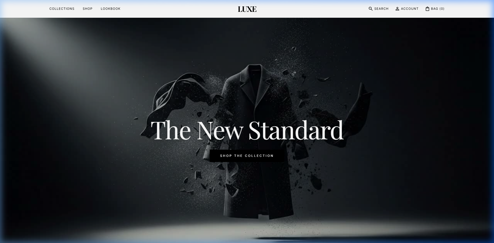
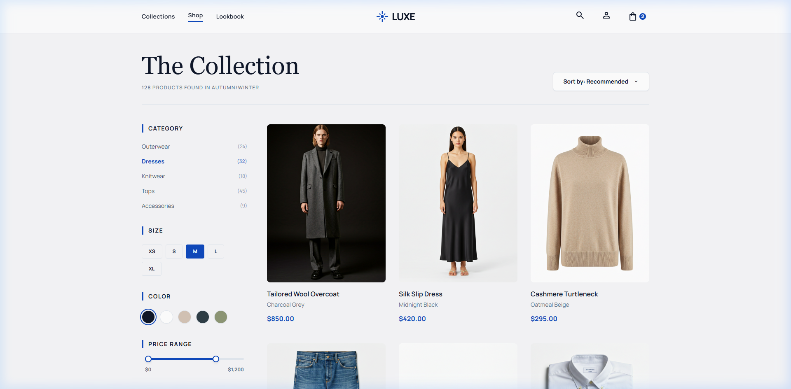
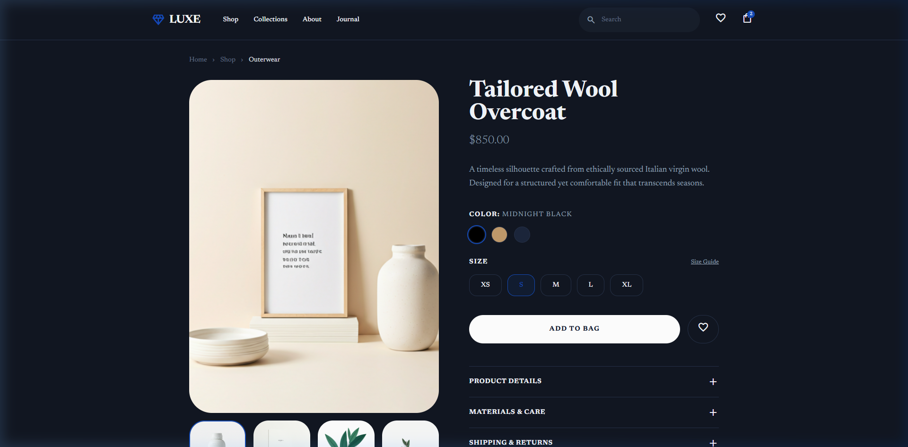
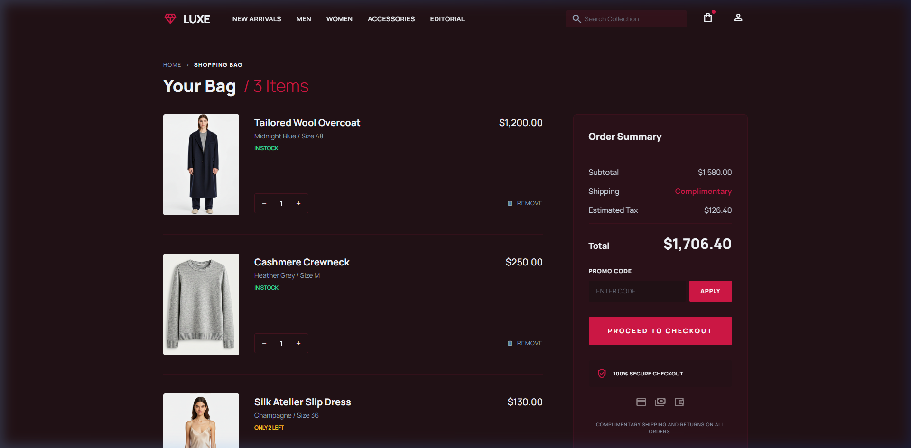
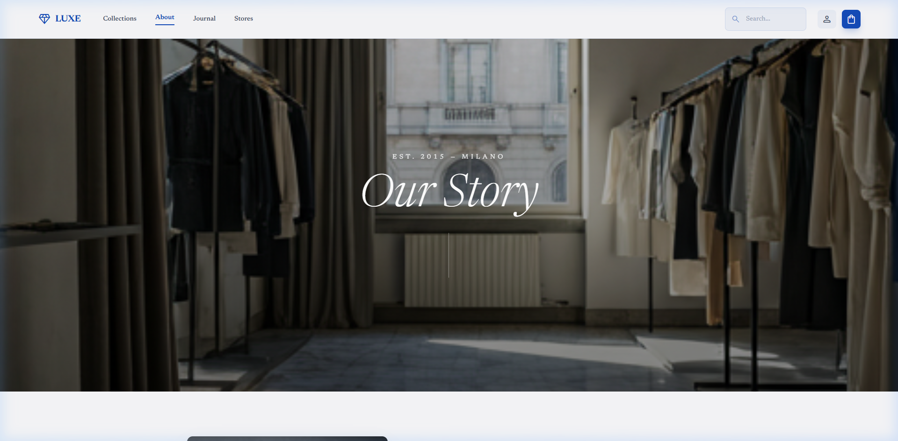
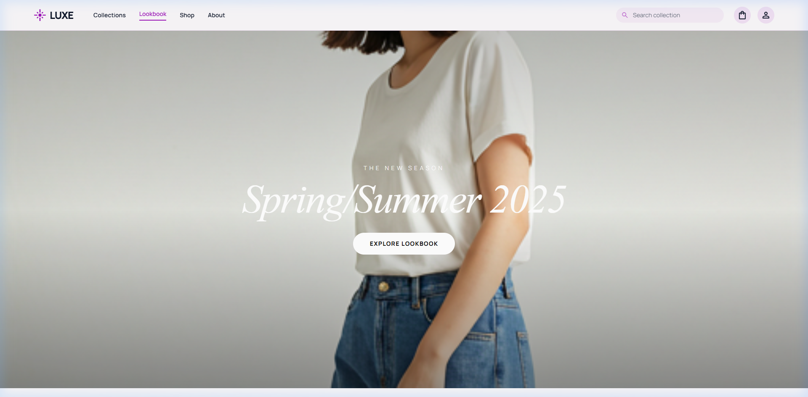

# LUXE — Website Showcase

A modern, minimal, fashion-forward e-commerce website built with **Stitch MCP**.

---

## 🎬 Full Walkthrough Video

The video below shows a complete walkthrough of all pages, including the scroll-driven hero animation on the homepage.

---

## 📸 Page Screenshots

### Homepage
Scroll-driven hero animation with 192-frame image sequence, featured collections, best sellers, newsletter, and footer.

---

### Shop
Product catalog with sidebar filters (Category, Size, Color, Price Range), sorting, and a 3-column product grid.

---

### Product Detail
Individual product page with image gallery, color/size selectors, add-to-bag, customer reviews, and recommendations.

---

### Shopping Cart
Cart summary with item controls, order total, promo code, checkout button, and cross-sell recommendations.

---

### About
Brand story, craftsmanship values, atelier behind-the-scenes, and editorial photography.

---

### Lookbook
Spring/Summer 2025 editorial lookbook with high-end fashion photography and shop-the-look cards.

---

## 🔗 Pages

| Page | File |
|------|------|
| Homepage | `index.html` |
| Shop | `shop.html` |
| Product | `product.html` |
| Cart | `cart.html` |
| About | `about.html` |
| Lookbook | `lookbook.html` |

---

*Built with Stitch MCP + Stitch Loop Skill • Brand: LUXE*
